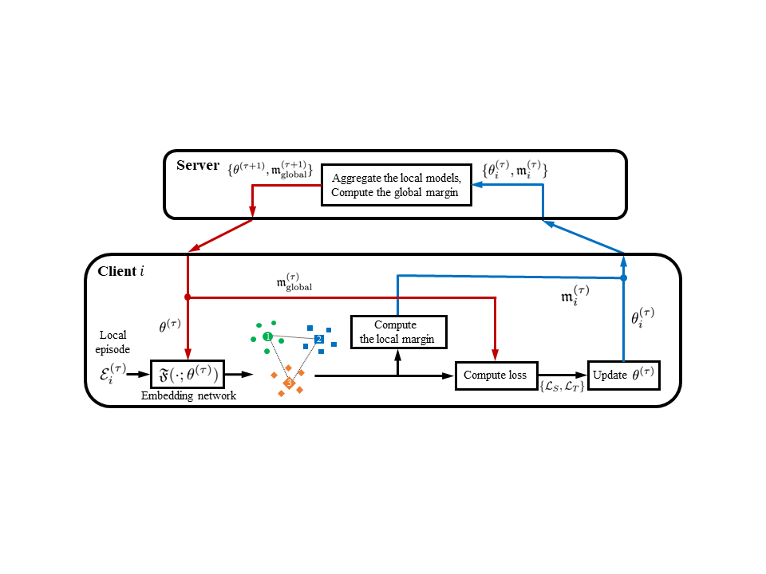
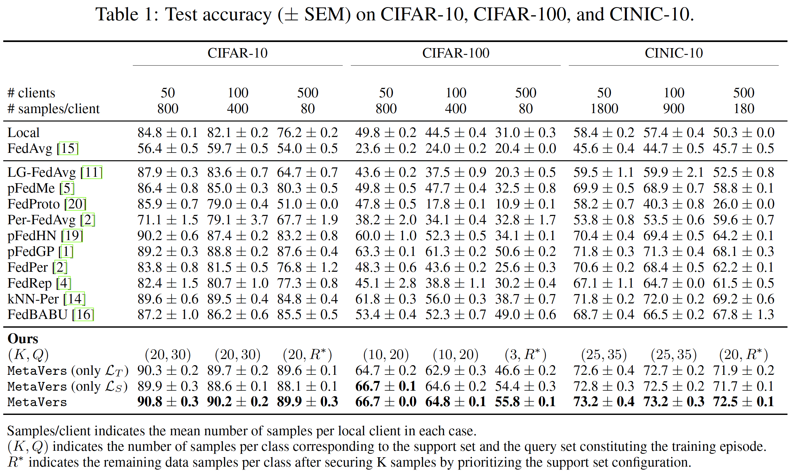

## MetaVers: Meta-Learned Versatile Representations with Large Margins for Personalized Federated Learning



#### Installation

- Create a virtual environment with ```conda create```

  -  ```conda create -n mvs python=3.8.5```

  - ```conda activate mvs```

  - ```pip install torch==1.7.1+cu110 torchvision==0.8.2+cu110 torchaudio==0.7.2 -f https://download.pytorch.org/whl/torch_stable.html```

  - ```pip install learn2learn```

  - ```pip install tensorboardX```

  - ```pip install tensorflow```

  - ```pip install sklearn```
  
    


---------

### Fast Run

##### Results on CIFAR-10

- Run: ```python trainer.py --dataset cifar10 --rand 0 --seed_list 42```

---------

##### Results on CIFAR-100
- Run: ```python trainer.py --dataset cifar100 --rand 0 --seed_list 42``` 

------

##### Results on CINIC-10

- Run: ```python trainer.py --dataset cinic --rand 0 --seed_list 42```

------

#####  For Details 

`--loss`: What loss to use, for cross-entropy; `ce` or tirplet; `riplet` . Default: `hybrid` 

`--d_from`: How to set the margin of the parameter used for triplet loss, for fixed  margin;`margin`  Default: `select`

`--w`: Interval Value $W$. Default: `50`

`--control`: Non-random way, according to the benchmark maximum way. Default: `fixed`

`--seed_list`: Receive a list of how to make a random seed (adjust the result randomness)

`--method`: Whether episodes are created locally in a decentralized setting, for centralized setting; `centralized` Default:  `decentralized`

`--lr`: Learning rate for gradient update. Default: `0.001`

`--optimizer`: Whether to use decay for Adam optimizer. When using a weight decay of 1e-3: `1` Default: `0`

`--evaluation_unit`: Evaluate using the validation set every n round. Default: `50`

`--activated`: Number of the activated clients. Default: `5`

`--embedder`: which model to use.[`conv4`, `lenet`,`resnet18`] Default: `lenet`

`--gamma`: loss balancing hyper parameter. Default: `0.5`

`--rand`: Fix the randomness of the PyTorch according to the seed.(adjust the result randomness) Default: `1`

------

### MetaVers: PFL Results Performance Reproduction 



##### PFL Results Performance Reproduction on CIFAR-10

-  ```python trainer.py --exp_name reproduction --loss hybrid --d_from select --w 50 --control fixed --seed_list 0 21 42 --dataset cifar10 --num_user 50 --optimizer 1 --train_shot 20 --train_query 30 --gamma 0.4  ```

-  ```python trainer.py --exp_name reproduction --loss hybrid --d_from select --w 50 --control fixed --seed_list 0 21 42 --dataset cifar10 --num_user 100 --optimizer 1 --train_shot 20 --train_query 30 --gamma 0.3  ```

-  ```python trainer.py --exp_name reproduction --loss hybrid --d_from select --w 50 --control fixed --seed_list 0 21 42 --dataset cifar10 --num_user 500 --optimizer 1 --train_shot 20 --train_query 30 --gamma 0.2  ``

**PFL Results Performance Reproduction on CIFAR-100**

-  ```python trainer.py --exp_name reproduction --loss hybrid --d_from select --w 50 --control fixed --seed_list 0 21 42 --dataset cifar100 --num_user 50 --optimizer 0 --shot_500 3 --train_shot 10 --train_query 20 --gamma 0.6  ```

-  ```python trainer.py --exp_name reproduction --loss hybrid --d_from select --w 50 --control fixed --seed_list 0 21 42 --dataset cifar100 --num_user 100 --optimizer 0 --shot_500 3 --train_shot 10 --train_query 20 --gamma 0.6  ```

-  ```python trainer.py --exp_name reproduction --loss hybrid --d_from select --w 500 --control fixed --seed_list 0 21 42 --dataset cifar100 --num_user 50 --optimizer 0 --shot_500 3 --train_query 15 --gamma 0.6  ```

##### PFL Results Performance Reproduction on CINIC-10

-  ```python trainer.py --exp_name reproduction --loss hybrid --d_from select --w 50 --control fixed --seed_list 0 21 42 --dataset cinic --num_user 50 --optimizer 0 --train_shot 25 --train_query 35 --gamma 0.5  ```

-  ```python trainer.py --exp_name reproduction --loss hybrid --d_from select --w 50 --control fixed --seed_list 0 21 42 --dataset cinic --num_user 100 --optimizer 0 --train_shot 25 --train_query 35 --gamma 0.5  ```
-  ```python trainer.py --exp_name reproduction --loss hybrid --d_from select --w 50 --control fixed --seed_list 0 21 42 --dataset cinic --num_user 500 --optimizer 0 --train_shot 20 --train_query 30 --gamma 0.5  ```

------

### Additional Experiment

##### [1] Only one Loss Example

- **Triplet Loss** (only $\mathcal{L}_{T}$) 
  ```python trainer.py --loss triplet --d_from margin --margin 3.0 --w 50 --dataset cinic --num_user 500 --exp_name triplet --seed_list 0 21 42 --optimizer 0 --train_shot 25 --train_query 35 --gamma 0.5 --lr 0.001 --gpu_number 0 ```
- **Cross-entropy Loss** (only $\mathcal{L}_{S}$) 
  ```python trainer.py --loss ce  --dataset cinic --num_user 500 --exp_name ce --seed_list 0 21 42 --optimizer 0 --train_shot 20 --train_query 30 --gamma 0.5 --lr 0.001 --gpu_number 0```

##### [2] Lower Way Example

- ```python trainer.py --loss hybrid --d_from select --w 50 --dataset cifar100 --num_user 100   --exp_name table4_low --low_way 5 --seed_list 0 21 42 --optimizer 0 --train_shot 10 --train_query 20```
- **Random Way**
  ```python trainer.py --random_way various --loss hybrid --d_from select --w 50 --dataset cinic --num_user 100   --exp_name table4_random --low_way 3 --seed_list 0 21 42 --optimizer 0 --train_shot 25 --train_query 35```

##### [3] Centralized Learning Example 

- ```python trainer.py --version eccv --loss hybrid --d_from select --w 50 --dataset cifar100 --num_user 50 --exp_name table5_central --method centralized --seed_list 0 21 42 --optimizer 0 --train_shot 10 --train_query 20 ```

------

##### CINIC-10 Dataset Download

- If the CINIC-10 dataset is not downloaded correctly, you can download it directly from the link and put it in the "'./cinic" folder. 
  https://datashare.is.ed.ac.uk/bitstream/handle/10283/3192/CINIC-10.tar.gz